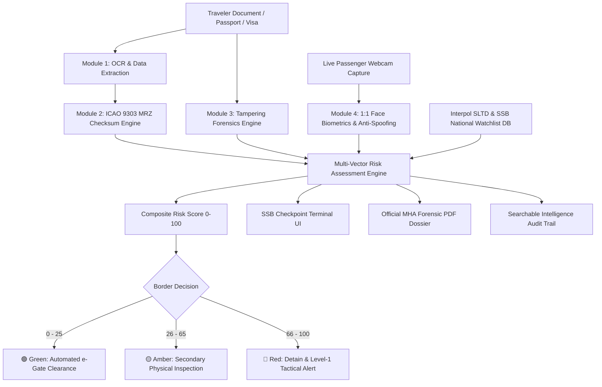

# AI-Based Fake Identity & Document Screening System
### Ministry of Home Affairs (MHA) • Sashastra Seema Bal (SSB), Police II Division
**Smart India Hackathon (SIH 2026) | Problem Statement ID: 26188 (SIH26188)**  
**Theme:** Blockchain & Cybersecurity / Homeland Security & Immigration Checkpoint Screening

---

## 📌 Executive Summary & Operational Background
Border checkpoints process thousands of identity and travel documents every day, including passports, visas, national identity cards, permits, and transit authorizations. Common challenges faced by border security personnel include:
- **Fake passports and visas** with altered photographs or modified dates of birth.
- **Tampered consular visa stamps and seals** to bypass entry restrictions.
- **Identity impersonation** and multi-identity aliases used by international fugitives.
- **Expired or blacklisted travel documents** in Interpol SLTD and national security registries.
- **High passenger volume causing bottlenecks and long queues** during manual inspection.

This platform delivers an **AI-Powered Mission-Critical Border Document Screening & Forensic Investigation Suite** capable of screening and cross-verifying identity credentials in **under 3 seconds**.

---

## 🚀 Core Functional Modules



### 🔍 Module 1: Optical Character Recognition (OCR) Extraction
- Multimodal Vision AI pipeline for structured extraction across all document formats (Passports, Visas, National IDs, Driving Licenses, Border Transit Permits).
- Extracts Visual Inspection Zone (VIZ) fields: Full Name, Document Number, Nationality, DOB, Expiry, Gender, Issuing Post, Visa Category, Stay Duration.
- Field-level optical confidence scoring (0-100%) and automatic coordinate mapping for anomaly highlighting.

### 📐 Module 2: Document Validation & ICAO Doc 9303 Compliance
- Complete mathematical verification of **ICAO 9303 Machine Readable Zone (MRZ)** standards (TD1, TD2, TD3).
- Strict **7-3-1 weight modulo-10 algorithm** verification across:
  - Document Number check digit
  - Date of Birth check digit
  - Expiration Date check digit
  - Personal Number check digit
  - Multi-field Composite Checksum
- **VIZ-to-MRZ Cross-Check Engine**: Instantly flags any discrepancies between printed visual text and encoded MRZ data (e.g. modified date of birth or altered passport digits).

### 🔬 Module 3: AI Document Tampering Forensics (Core Innovation)
- **1. Error Level Analysis (ELA) Heatmap**: Real-time HTML5 canvas compression analysis highlighting JPEG quantization variance between spliced portrait photos and document substrates.
- **2. Splicing Edge & Boundary Discontinuity**: Locates halo edges, gradient drops, and cut-and-paste margins around replacement photos.
- **3. Text Manipulation & Baseline Misalignment**: Detects manual scraping, font family inconsistencies, and micro-metric vertical character shifts.
- **4. Stamp & Seal Forgery Analysis**: Compares circular edge symmetry, Fourier frequency grids, and physical ink capillary bleed against official consular stamps.
- **5. Digital Metadata & Software Traces**: Identifies embedded signatures of photo-manipulation software (Adobe Photoshop, GIMP, Canva, CorelDraw, PicsArt).

### 👤 Module 4: 1:1 Facial Biometrics & Anti-Spoofing
- 1:1 facial biometric matching comparing extracted document portrait against live passenger webcam feed.
- Cosine similarity matching score (0-100%) based on 68 facial nodal landmarks.
- **Anti-Spoofing & Liveness Challenge**:
  - High-frequency moiré pattern detection (screen replay attacks).
  - Surface paper texture analysis (printed photo attacks).
  - Active 3D depth and natural eye-blink verification.

---

## 🎯 Preloaded Interactive Test Scenarios (1-Click Evaluation)
The terminal includes 5 pre-packaged test cases for immediate interactive demonstration:
1. **Case #1: Genuine Indian Diplomatic Passport** -> 100% Authentic, Valid 7-3-1 MRZ, Clean ELA, Biometric Match (96.8%), **4% Risk (Clear)**.
2. **Case #2: Spliced Nepalese Border Permit (Photo Replaced)** -> Spliced edge halo, severe ELA compression anomaly, face mismatch (28.4%), **92% Risk (Detain)**.
3. **Case #3: Modified Date of Birth Passport (UK/India)** -> Visual DOB says 1994 vs MRZ says 1982, font baseline shift, **78% Risk (Detain)**.
4. **Case #4: Counterfeit Schengen Tourist Visa (Cloned Seal)** -> Cloned rubber stamp without authentic ink absorption, **72% Risk (Detain)**.
5. **Case #5: Interpol Red Notice (Transnational Wanted Fugitive)** -> Biometric match against wanted alias Vladimir Ivanov, **99% Risk (Critical Level-1 Tactical Alert)**.

---

## 🛠 Technology Stack
- **Frontend:** React 19, TypeScript, Vite, Tailwind CSS, Lucide Icons, Recharts, Framer Motion.
- **Forensic Engine:** HTML5 Canvas Error Level Analysis (ELA), 7-3-1 Weight ICAO MRZ Validator, Cosine Biometric Similarity Engine.
- **Backend:** Node.js, Express, TypeScript, Google Gemini 2.5 Flash Vision Multimodal API, Multer, Helmet, Winston.
- **Security & Reporting:** Cryptographic audit trail hashing, jsPDF / print-ready Official MHA Screening Dossier generation.

---

## ⚡ Quickstart & Running Locally

### 1. Frontend Development Server
```bash
npm install
npm run dev
```
Access the screening terminal at `http://localhost:3000`.

### 2. Backend Server
```bash
cd server
npm install
npm run dev
```
Backend API will start on port `5000`.

---
© 2026 Smart India Hackathon • Ministry of Home Affairs • Sashastra Seema Bal (SSB)
